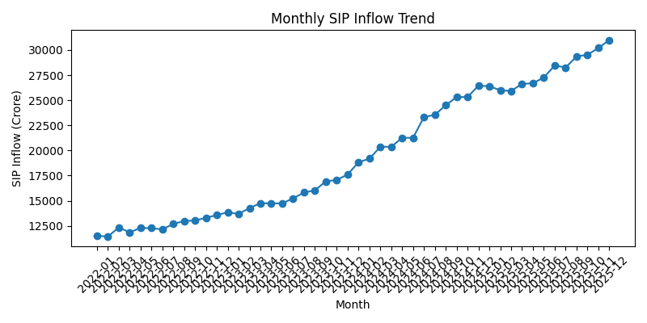
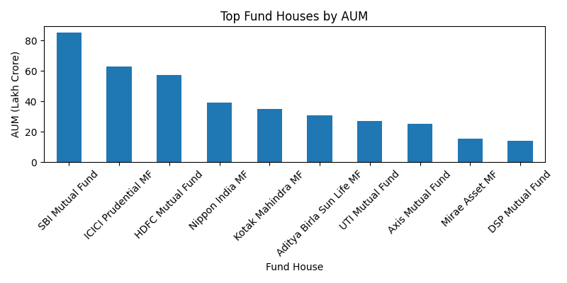
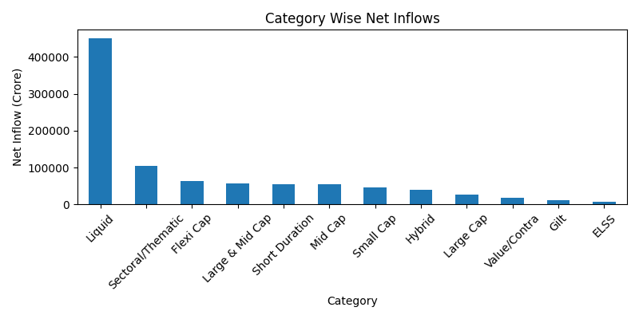
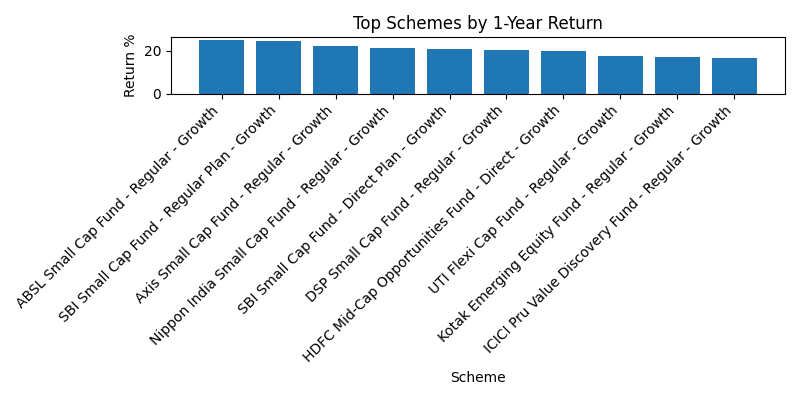

# Bluestock Mutual Fund Analytics Capstone Project

## Project Overview

The Bluestock Mutual Fund Analytics Project is an end-to-end data engineering and analytics solution developed using Python, SQLite, SQL, and Matplotlib. The project focuses on processing and analyzing mutual fund industry data to generate meaningful insights related to fund performance, SIP investments, Assets Under Management (AUM), category-wise inflows, investor participation, and portfolio holdings.

The project demonstrates the complete data lifecycle, including data ingestion, transformation, storage, analysis, and visualization.

---

## Objectives

* Build an automated ETL pipeline for mutual fund datasets.
* Store processed data in a structured SQLite database.
* Perform SQL-based analytical queries on mutual fund data.
* Generate visual dashboards for business insights.
* Create a reusable analytics framework for mutual fund analysis.

---

## Dataset Description

The project uses multiple datasets covering different aspects of the mutual fund industry:

1. Fund Master Data
2. NAV History
3. AUM by Fund House
4. Monthly SIP Inflows
5. Category-wise Inflows
6. Industry Folio Count
7. Scheme Performance
8. Investor Transactions
9. Portfolio Holdings
10. Benchmark Indices
11. Live NAV Data

---

## ETL Pipeline

### Extract

Data was extracted from CSV files stored in the raw data folder.

### Transform

Data cleaning and preprocessing included:

* Standardizing column names
* Removing duplicate records
* Validating data quality
* Preparing datasets for database storage

### Load

The cleaned datasets were loaded into a SQLite database using Python and Pandas.

---

## Database Implementation

A SQLite database was created to store all processed datasets.

Key activities:

* Database creation
* Table generation
* Data loading
* Query execution and validation

The database enables efficient retrieval and analysis of mutual fund data.

---

## Data Analysis

SQL queries were developed to analyze:

* SIP inflow trends
* Fund house AUM rankings
* Category-wise inflows
* Industry folio growth
* Mutual fund scheme performance
* Investor transaction patterns
* Portfolio holdings

The analysis provides insights into investment trends and fund performance.

---

## Dashboard and Visualization

A dashboard was developed using Matplotlib to visualize key metrics.

Generated visualizations include:

## Dashboard Visualizations

### 1. Monthly SIP Inflow Trend

This chart shows the monthly SIP inflow trend and highlights investor participation growth over time.

---

### 2. Top Fund Houses by AUM

This chart compares the Assets Under Management (AUM) of leading fund houses.

---

### 3. Category-wise Net Inflows

This chart displays how investment inflows are distributed across different mutual fund categories.

---

### 4. Top Schemes by 1-Year Return

This chart highlights the top-performing mutual fund schemes based on 1-year returns.
These visualizations help interpret trends and support data-driven decision making.

---

## Key Findings

* SIP inflows show a positive growth trend over time.
* Equity-oriented categories attract significant investor interest.
* A small number of fund houses manage a large share of industry AUM.
* High-performing schemes often exhibit higher risk characteristics.
* Investor participation continues to grow based on folio trends.

---

## Technologies Used

* Python
* Pandas
* SQLite
* SQL
* Matplotlib
* Git
* GitHub

---

## Project Outcome

The project successfully implemented a complete data engineering and analytics workflow. It demonstrates practical skills in ETL development, database management, SQL analysis, and data visualization while providing meaningful insights into mutual fund industry trends.

---

## Conclusion

The Bluestock Mutual Fund Analytics Project showcases how raw financial datasets can be transformed into actionable insights through structured data processing and analysis. The project highlights the importance of ETL pipelines, database systems, analytical queries, and visualization techniques in modern data analytics workflows.
